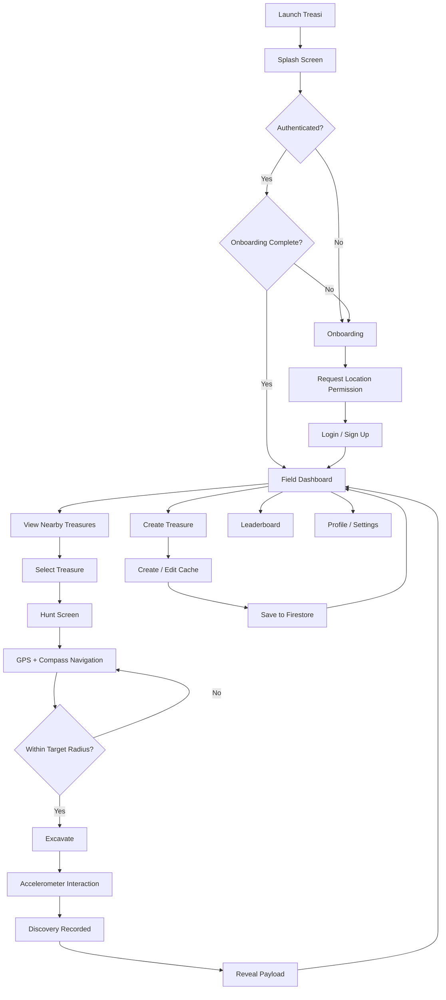
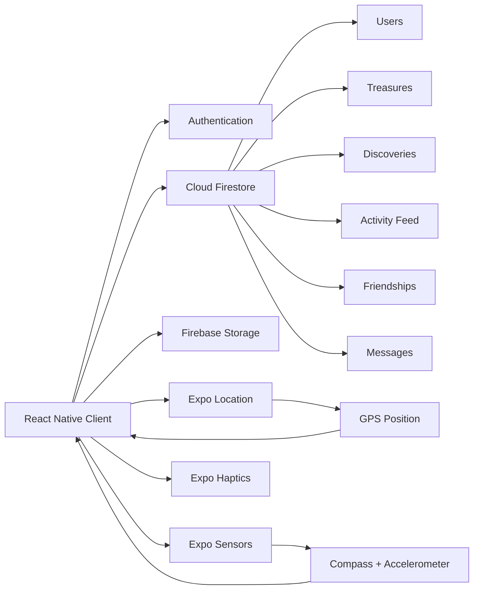

# Treasi

> **Hide. Explore. Stay connected.**

Treasi is a landscape-locked, sensor-driven asynchronous scavenger hunt built with React Native and Firebase. The application transforms physical spaces into an interactive field of hidden digital treasures, allowing explorers to create caches, navigate towards them using live GPS and compass telemetry, and excavate them when they reach the target area.

The project was developed for **Interactive Development 300 (DV300), Semester 2, Theme 3**.

---

## Table of Contents

- [Project Overview](#project-overview)
- [The Problem](#the-problem)
- [The Concept](#the-concept)
- [Project Inspiration](#project-inspiration)
- [Target Users](#target-users)
- [Core Features](#core-features)
- [User Flow](#user-flow)
- [Technology Stack](#technology-stack)
- [Application Architecture](#application-architecture)
- [Firebase Data Model](#firebase-data-model)
- [Project Structure](#project-structure)
- [Prerequisites](#prerequisites)
- [Installation](#installation)
- [Firebase Setup](#firebase-setup)
- [Running the Application](#running-the-application)
- [How to Use Treasi](#how-to-use-treasi)
- [CRUD Operations](#crud-operations)
- [Sensor and Location Features](#sensor-and-location-features)
- [Landscape Interface](#landscape-interface)
- [Accessibility and Usability](#accessibility-and-usability)
- [Design System](#design-system)
- [Responsive and Platform Behaviour](#responsive-and-platform-behaviour)
- [Development Workflow](#development-workflow)
- [Testing Checklist](#testing-checklist)
- [Known Limitations](#known-limitations)
- [Future Improvements](#future-improvements)
- [Demonstration Video](#demonstration-video)
- [Project Contribution](#project-contribution)
- [Acknowledgements](#acknowledgements)
- [License](#license)

---

## Project Overview

Treasi is designed around three constraints:

1. **Goal Theme:** Stay Connected
2. **Device Interaction:** Device Sensors
3. **Constraint:** Landscape Support

Rather than treating landscape orientation as a limitation, Treasi uses it as a central part of the experience. The phone becomes a digital field instrument inspired by analogue surveying equipment, vintage maps, military dashboards and national park ranger equipment.

The application encourages users to leave passive social-media interactions behind and engage with their physical surroundings. Users can hide digital treasures at real-world coordinates and other explorers can discover them later.

Each treasure can contain:

- A title
- A clue or hint
- A hidden payload/message
- A physical GPS location
- A creator
- An archive state
- Optional image metadata

The hunting experience combines a live map, GPS distance calculations, compass heading and an accelerometer-based excavation interaction.

---

## The Problem

Modern social platforms make digital communication extremely convenient, but they can also encourage passive screen use and reduce interaction with the physical environment.

Treasi addresses this by creating an asynchronous social experience that exists in physical space.

Instead of sending a normal message such as:

> "Meet me after class."

an explorer can hide a digital treasure at a real location. Another explorer can discover it while walking between lectures, studios or other destinations.

This creates a social interaction that is:

- Physical rather than purely digital
- Asynchronous rather than dependent on everyone being online simultaneously
- Location-based rather than feed-based
- Playful rather than transactional
- Designed around exploration and discovery

---

## The Concept

The central interaction is the **field treasure**.

### Hider

A user can stand at a physical location and create a treasure cache by recording:

- The cache title
- A clue
- A hidden payload
- The current or manually entered coordinates

The treasure is then stored remotely in Firebase Firestore.

### Hunter

Another user can view active nearby caches, select a target and enter the hunting interface.

The application uses GPS to calculate the user's distance from the target. A compass interface provides directional guidance.

When the explorer reaches the target area, the application can use the device accelerometer to detect a deliberate shake and trigger the excavation interaction.

### Discovery

After successful excavation:

1. The treasure is marked as discovered for that explorer.
2. A discovery record is created.
3. The activity feed is updated.
4. The explorer receives points.
5. The hidden payload is revealed.

This creates a complete loop:

**Hide → Navigate → Locate → Excavate → Discover → Connect**

---

## Project Inspiration

Treasi's visual identity combines:

- 1960s national park ranger equipment
- Military mechanical dashboards
- Vintage field guides
- Surveying instruments
- Weathered paper maps
- Brass hardware
- Typewriter and analogue instrumentation

The visual language intentionally avoids a contemporary SaaS aesthetic. Depth, texture, borders, mechanical controls and analogue terminology are used to make the application feel like a physical field instrument.

---

## Target Users

### Primary Persona: The Curious Creative Explorer

**Age:** 18–26

**Typical user:** Creative arts, design, media or technology student.

**Environment:** University campus, studio environment or urban area.

**Motivations:**

- Wants meaningful social interaction
- Enjoys visually distinctive experiences
- Likes games and alternative forms of interaction
- Enjoys exploration
- Appreciates tactile or physical interaction
- Has limited time for traditional social gatherings

**Problem:**

Academic schedules and digital communication can make social interaction feel fragmented. Treasi turns ordinary movement through a campus or city into an opportunity for discovery.

---

## Core Features

### Authentication

Treasi uses Firebase Authentication for account registration and login.

Users can:

- Create an account
- Sign in with email and password
- Remain authenticated between application sessions
- Sign out
- Update their profile information

Authentication state is monitored through Firebase Auth.

---

### Onboarding

The application includes a three-stage onboarding sequence:

1. **Align Instrument**
   - Introduces the landscape orientation requirement.
   - Explains the field-instrument concept.

2. **Track Targets**
   - Introduces GPS and compass telemetry.
   - Requests foreground location permission.

3. **Excavate Rewards**
   - Explains the physical interaction required to discover a cache.
   - Introduces the kinetic shake interaction.

The onboarding state is persisted locally with AsyncStorage and synchronised with the user's Firebase profile.

---

### Landscape-Locked Interface

Treasi is designed as a landscape-first application.

The interface uses a split-screen structure:

- **Left 60%:** operational map/instrument area
- **Right 40%:** control console, telemetry and actions

This structure is used throughout the main application experience to reinforce the field-instrument concept.

---

### Field Dashboard

The dashboard provides an overview of the active field.

It includes:

- User location
- Nearby treasure markers
- Treasure selection
- Distance information
- Activity/field signals
- Navigation to hunting
- Access to cache management
- Access to social/leaderboard functionality
- Main field action for creating a treasure

Active treasure records are synchronised from Firestore in real time.

---

### Treasure Creation

Users can create a new field cache.

A treasure contains:

title
hint
payloadText
creatorId
creatorName
location
isArchived
createdAt

The location is stored as a Firestore `GeoPoint`.

After creation, an activity event is added to the field activity feed.

---

### Treasure Hunting

The hunting screen retrieves a selected treasure and begins location tracking.

The interface provides:

- Target information
- Clue/hint
- Live GPS distance
- GPS accuracy/status
- Compass direction
- Sensor status
- Excavation state
- Hidden payload

The hunter must physically reach the target area before excavation can occur.

---

### Compass Navigation

The hunting screen uses the device's magnetometer to calculate heading information.

The compass is presented as a custom vintage instrument rather than a standard digital compass.

The implementation uses sensor updates and animation to create a responsive compass needle.

---

### Kinetic Excavation

The application uses the device accelerometer to detect a physical shaking gesture.

The intended interaction is:

1. Navigate towards the target.
2. Enter the target radius.
3. Activate the excavation interaction.
4. Shake the device.
5. The accelerometer detects the movement.
6. The discovery is recorded.
7. The hidden payload is revealed.

A haptic feedback response is used after successful excavation.

---

### Inventory and Cache Management

The Inventory screen provides access to nearby field caches and the user's own planted caches.

Cache records support:

- **Create**
- **Read**
- **Update**
- **Delete**
- **Archive**

Only the creator of a cache can modify, archive or permanently delete that cache.

Archiving is implemented as a soft-delete mechanism by changing:

```text
isArchived = true
```

Permanent deletion removes the Firestore treasure document.

---

### Leaderboard

The Leaderboard screen displays explorers ranked by their accumulated points.

The leaderboard:

- Reads users from Firestore
- Orders them by total points
- Displays the top 50 entries
- Highlights the current user
- Provides nearby explorer information

---

### Friendships

Treasi includes a friendship system that allows explorers to create peer connections.

Supported friendship states include:

- `pending`
- `accepted`
- `declined`
- `blocked`

Friendship records are stored in the Firestore `friendships` collection.

---

### Field Messages

Explorers can send short field messages/telegrams.

Messages are stored remotely in the Firestore `messages` collection.

The social interface uses the application's field-operation terminology to maintain the overall theme.

---

### Activity Feed

The dashboard includes a real-time field activity feed.

Events include:

- Treasure hidden
- Treasure found
- Friend accepted

Activity records are stored in:

```text
activity_feed
```

---

### Profile and Settings

The profile/settings area provides controls for:

- Agent/callsign information
- Haptic feedback
- Sensor sensitivity
- Battery optimisation preference
- Night field mode
- Telemetry preference
- Onboarding/authentication flow preference
- Sign out

These settings are persisted to the user's Firestore document.

---

## User Flow



---

## Technology Stack

### Frontend

| Technology | Purpose |
|---|---|
| React Native | Cross-platform mobile application framework |
| TypeScript | Type-safe application development |
| Expo | Development and native device integration |
| React Navigation | Application navigation |
| React Native Reanimated | Animation and motion |
| React Native SVG | Custom vector UI elements |
| React Native Maps | Native map rendering |
| Expo Location | GPS and location services |
| Expo Sensors | Magnetometer and accelerometer access |
| Expo Haptics | Haptic feedback |
| AsyncStorage | Local onboarding/authentication state |
| Expo Font | Custom typography |

### Backend / Cloud

| Technology | Purpose |
|---|---|
| Firebase Authentication | User registration and authentication |
| Cloud Firestore | Remote application database |
| Firebase Storage | Storage service configured for the application |
| Firebase JS SDK | Client-side Firebase integration |

### Development

| Technology | Purpose |
|---|---|
| Node.js | JavaScript runtime for the development environment |
| npm | Dependency and script management |
| Git | Version control |
| GitHub | Repository hosting and collaboration |

---

## Application Architecture

Treasi follows a client + Backend-as-a-Service architecture.



There is no separate Node/Express API server in the current implementation. Firebase acts as the backend service.

---

## Firebase Data Model

### `users`

Stores authenticated explorer profiles and persistent settings.

Key fields include:

```text
uid
username
email
totalPoints
hasCompletedOnboarding
telemetryEnabled
hapticFeedbackEnabled
motionSensitivityEnabled
batteryOptimizerEnabled
nightModeEnabled
skipOnboardingAuthFlow
createdAt
updatedAt
```

---

### `treasures`

Stores physical field caches.

```text
treasureId
creatorId
creatorName
title
hint
payloadText
imageUrl
location
isArchived
createdAt
```

`location` is stored as a Firestore `GeoPoint`.

---

### `discoveries`

Tracks successful treasure excavations.

```text
discoveryId
treasureId
hunterId
unlockedAt
```

The discovery record prevents the same explorer from receiving duplicate discovery credit for the same treasure.

---

### `messages`

Stores field messages between explorers.

```text
messageId
senderId
senderName
text
createdAt
```

---

### `friendships`

Stores explorer relationships and requests.

```text
friendshipId
requesterId
receiverId
status
createdAt
updatedAt
```

Supported statuses:

```text
pending
accepted
declined
blocked
```

---

### `activity_feed`

Stores field events shown on the dashboard.

```text
activityId
userId
username
type
message
targetId
createdAt
```

Supported activity types currently represented by the application include:

```text
TREASURE_HIDDEN
TREASURE_FOUND
FRIEND_ACCEPTED
```

---

## Project Structure

```text
Treasi/
├── assets/
│   ├── adaptive-icon.png
│   ├── favicon.png
│   ├── icon.png
│   ├── Logo.svg
│   └── splash-icon.png
│
├── src/
│   ├── components/
│   │   ├── FieldMap.native.tsx
│   │   ├── FieldMap.web.tsx
│   │   ├── FieldNavBar.tsx
│   │   └── LandscapeSplitLayout.tsx
│   │
│   ├── config/
│   │   └── firebase.ts
│   │
│   ├── hooks/
│   │   ├── useAuth.ts
│   │   └── useLandscapeOrientation.ts
│   │
│   ├── navigation/
│   │   └── RootNavigator.tsx
│   │
│   ├── screens/
│   │   ├── Auth/
│   │   │   ├── LoginScreen.tsx
│   │   │   └── SignUpScreen.tsx
│   │   ├── DashboardScreen.tsx
│   │   ├── HuntScreen.tsx
│   │   ├── InventoryScreen.tsx
│   │   ├── LeaderboardScreen.tsx
│   │   ├── OnboardingScreen.tsx
│   │   ├── ProfileSettingsScreen.tsx
│   │   └── SplashScreen.tsx
│   │
│   └── types/
│       ├── firestore.ts
│       ├── navigation.ts
│       └── svg.d.ts
│
├── App.tsx
├── app.json
├── babel.config.js
├── index.ts
├── metro.config.js
├── package.json
├── package-lock.json
└── tsconfig.json
```

---

## Prerequisites

Before installing Treasi, make sure the development environment has:

- Node.js installed
- npm installed
- A supported Android or iOS development environment
- Expo tooling
- A Firebase project
- A physical device or emulator/simulator for testing

For the sensor-based functionality, a **physical device is strongly recommended**. GPS, magnetometer, accelerometer and haptic behaviour cannot be fully represented by a standard web browser.

---

## Installation

### 1. Clone the repository

```bash
git clone <YOUR-GITHUB-REPOSITORY-URL>
cd Treasi
```

Replace `<YOUR-GITHUB-REPOSITORY-URL>` with the URL of the final GitHub repository.

### 2. Install dependencies

```bash
npm install
```

### 3. Configure Firebase

Create or use a Firebase project and configure the application as described in the [Firebase Setup](#firebase-setup) section.

### 4. Start Expo

```bash
npm start
```

Expo will display the available development options.

---

## Firebase Setup

Treasi uses Firebase as its backend service.

### Step 1: Create a Firebase Project

Create a Firebase project through the Firebase Console.

### Step 2: Enable Authentication

Enable:

```text
Authentication
└── Sign-in method
    └── Email/Password
```

This is required for account registration and login.

### Step 3: Create Firestore

Create a Cloud Firestore database.

Treasi uses the following collections:

```text
users
treasures
discoveries
messages
friendships
activity_feed
```

The application creates many records dynamically when users interact with the system.

### Step 4: Configure Storage

Firebase Storage is included in the application's Firebase configuration for remote asset storage.

### Step 5: Add Firebase Configuration

The Firebase client configuration is located at:

```text
src/config/firebase.ts
```

For a production submission, the Firebase configuration should be managed using the project's preferred environment/configuration strategy rather than exposing sensitive project configuration unnecessarily.

### Step 6: Configure Firestore Rules

The database should be protected with rules appropriate to the application.

At minimum, rules should ensure that:

- Authenticated users can access application data only where appropriate.
- Users cannot modify another user's profile without permission.
- Users cannot modify or delete treasures belonging to another creator.
- Discovery records cannot be manipulated to award duplicate discoveries.
- Friendship operations are limited to the relevant users.
- Message access is restricted appropriately.

The exact production rules are dependent on the final Firebase deployment configuration.

---

## Running the Application

### Android

```bash
npm run android
```

This launches the Expo Android development workflow.

### iOS

```bash
npm run ios
```

This launches the Expo iOS development workflow.

### Web

```bash
npm run web
```

A web implementation is included for development/testing. The native map and device-sensor experience is intended primarily for Android and iOS.

---

## How to Use Treasi

### First launch

1. Open Treasi.
2. Complete the splash screen.
3. Complete the three onboarding stages.
4. Grant foreground location permission.
5. Create an account or sign in.
6. Enter the Field Dashboard.

### Create a treasure

1. Open the cache/inventory interface.
2. Select the option to create a new field cache.
3. Confirm or enter the target coordinates.
4. Enter a title.
5. Add a clue.
6. Add the hidden payload.
7. Submit the cache.
8. The treasure is written to Firestore.
9. The activity feed records the new cache.

### Hunt a treasure

1. Select a treasure marker from the dashboard or inventory.
2. Open the Hunt screen.
3. Follow the live distance information.
4. Use the compass to orient towards the target.
5. Continue until the target is within the required proximity.
6. Complete the excavation interaction.
7. The application records the discovery.
8. The payload is revealed.

### Manage a treasure

If you created a treasure, you can:

- Edit its title
- Edit its clue
- Edit its payload
- Archive the cache
- Permanently delete the cache

---

## CRUD Operations

Treasi implements remote CRUD operations using Cloud Firestore.

### Create

A new treasure is added to:

```text
treasures
```

using a Firestore document.

### Read

The application reads:

- User profiles
- Treasure records
- Discoveries
- Leaderboard entries
- Activity feed events
- Friendship records
- Messages

Several views use Firestore real-time listeners so changes can appear without manually refreshing the application.

### Update

Treasure metadata can be updated by its creator.

Examples:

```text
title
hint
payloadText
isArchived
```

User profile and settings data can also be updated.

### Delete

Treasure creators can permanently delete their own treasure documents.

The application also supports soft deletion through the archive state:

```text
isArchived = true
```

---

## Sensor and Location Features

### GPS

Treasi uses Expo Location for:

- Requesting foreground location permission
- Obtaining the user's current position
- Watching location changes
- Calculating distance to treasures
- Displaying the user's position on the map

The hunting experience uses higher-accuracy location tracking when actively navigating towards a target.

### Magnetometer

The Hunt screen uses the device magnetometer to provide heading information for the custom compass interface.

The sensor stream is sampled frequently enough to make the compass responsive while the interface uses animated values to reduce visible jitter.

### Accelerometer

The accelerometer is used to detect the physical movement associated with the excavation interaction.

### Haptics

Expo Haptics is used to provide feedback after important interactions, including successful excavation.

---

## Landscape Interface

Landscape orientation is not simply a technical requirement. It is part of Treasi's interaction model.

The application uses a **60/40 split**:

```text
┌─────────────────────────────────────────────────────────────┐
│                                                             │
│             LEFT 60%             │       RIGHT 40%          │
│                                  │                          │
│     MAP / INSTRUMENTS            │    TELEMETRY             │
│     OPERATIONAL VIEW             │    CONTROLS              │
│                                  │    ACTIONS                │
│                                  │    FIELD DATA             │
│                                  │                          │
└─────────────────────────────────────────────────────────────┘
```

The left side is primarily responsible for visualising the physical environment, while the right side functions as the control console.

---

## Accessibility and Usability

The interface is designed to preserve accessibility while maintaining its vintage visual identity.

### Contrast

The primary body text uses a dark ink colour against light parchment surfaces to maintain strong readability.

### Touch targets

Interactive controls are designed around touch-friendly target sizes, with the project's design planning targeting approximately **48 × 48 dp** for important controls.

### Screen readers

Decorative visual elements should not be treated as meaningful content by screen readers.

Important telemetry information is exposed through semantic labels where appropriate.

### Motion accessibility

The physical shake interaction can present an accessibility barrier for users with different motor capabilities.

The project therefore includes a fallback interaction concept that allows excavation through an alternative control rather than requiring a physical shake.

### Landscape ergonomics

The main controls are positioned within the right-hand control area to keep important actions predictable when the phone is held horizontally.

---

## Design System

Treasi uses a vintage field-instrument visual language.

### Typography

| Role | Typeface |
|---|---|
| Headings | Courier Prime |
| Body | Old Standard TT |

### Colour Palette

| Token | Hex | Use |
|---|---|---|
| Forest Deep | `#2C3B2E` | Main dark background/chassis |
| Parchment | `#E8DCC0` | Primary light surfaces |
| Secondary Parchment | `#F3ECD8` | Secondary light surfaces |
| Sienna Accent | `#A64B2A` | CTAs and high-priority actions |
| Brass Trim | `#B08D57` | Borders, controls and hardware details |
| Ink Black | `#2A2420` | Primary text |

### Visual principles

The UI uses:

- Vintage paper textures
- Brass-style borders
- Mechanical controls
- Field terminology
- Analogue-inspired displays
- Strong horizontal composition
- Subtle motion
- Clear system/status feedback

---

## Responsive and Platform Behaviour

Treasi is designed primarily for Android and iOS landscape layouts.

### Native map

On native platforms, the application uses `react-native-maps`.

### Web map fallback

A web-specific `FieldMap.web.tsx` implementation is provided so the project can run through Expo Web without depending on the native map implementation.

### Orientation

The application is configured for landscape orientation through Expo configuration and the `useLandscapeOrientation` hook.

### Device differences

Different Android and iOS devices have different:

- Aspect ratios
- Sensor hardware
- GPS accuracy
- Compass calibration
- Screen sizes

The UI therefore uses dynamic dimensions and flex-based layout rather than relying exclusively on fixed screen sizes.

---

### Pull request process

1. Create a feature branch from `develop`.
2. Implement the feature.
3. Test the feature locally.
4. Open a pull request into `develop`.
5. Review the implementation.
6. Resolve issues.
7. Merge into `develop`.
8. Promote stable code to `main`.

Direct development commits to the production branch should be avoided.

---

## Known Limitations

The following limitations should be considered when evaluating the current implementation.

### Physical sensor dependency

Compass and accelerometer functionality depends on the physical capabilities and calibration of the device.

### GPS accuracy

GPS accuracy can vary depending on:

- Device hardware
- Indoor/outdoor conditions
- Environmental obstruction
- Network availability
- Satellite visibility

The application therefore displays telemetry/GPS status information during navigation.

### Battery consumption

Continuous location and sensor monitoring can increase battery consumption.

The application includes a battery optimisation preference and uses less aggressive location updates in broader field scanning contexts.

### Web limitations

The web version cannot reproduce the full native sensor experience of an Android/iOS device.

The native mobile build should be used for the final sensor-driven demonstration.

### Firebase configuration

The application requires an accessible Firebase project with the required services configured before the complete remote functionality can operate.

### Image payloads

The data model supports an optional `imageUrl`, and the hunting interface can display an image when one is present. The current cache-creation flow primarily focuses on text-based treasure content.

---

## Future Improvements

Potential future development includes:

1. More advanced image capture and Firebase Storage upload for treasure evidence.
2. Expanded achievement/badge functionality.
3. Improved offline support for field exploration.
4. More sophisticated GPS accuracy handling.
5. Additional compass calibration feedback.
6. More advanced anti-cheat validation for discovery events.
7. Richer friendship and messaging interactions.
8. Expanded leaderboard statistics.
9. More field locations and community-created treasure zones.
10. More detailed analytics for exploration activity.
11. Improved sensor fallbacks for accessibility.
12. Automated Firebase security-rule testing.
13. Production environment configuration using environment variables.
14. Formal Android and iOS release builds through the appropriate deployment pipelines.

---

### Video link

**Add final demonstration video link here:**

```text
[DEMO VIDEO LINK]
```

## Project Contribution

### Angie van Rooyen

**Student Number:** 241077

**Institution:** Open Window, Department of Fundamentals

**Course:** Interactive Development 300

**Project:** Treasi

---

## Acknowledgements

Treasi was developed using the following technologies and libraries:

- React Native
- Expo
- TypeScript
- Firebase Authentication
- Cloud Firestore
- Firebase Storage
- React Navigation
- React Native Maps
- React Native Reanimated
- React Native SVG
- Expo Location
- Expo Sensors
- Expo Haptics
- Expo Font
- AsyncStorage

The project also draws on the interaction patterns and visual language of:

- Vintage field guides
- Surveying instruments
- Analogue navigation equipment
- National park ranger equipment
- Mechanical dashboards
- Typewriter and archival design

All external libraries and frameworks remain subject to their respective licences and documentation.

---

## License

This project was created as an academic submission for Open Window's Interactive Development 300 course.

Unless otherwise stated, the project's original application code, visual design and project-specific assets should be treated as academic work belonging to the project author.

Third-party libraries, frameworks and assets remain subject to their respective licences.

---

## Project Statement

> **Treasi transforms everyday physical routes into interactive grounds for discovery and connection. By combining landscape-first interaction, GPS, compass telemetry, accelerometer input and Firebase-powered social data, the application turns a smartphone from a passive communication device into a tactile field instrument.**

**Treasi — Hide. Explore. Stay connected.**
